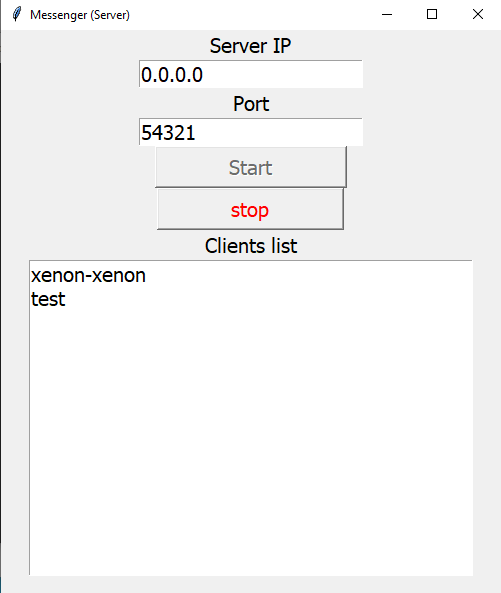
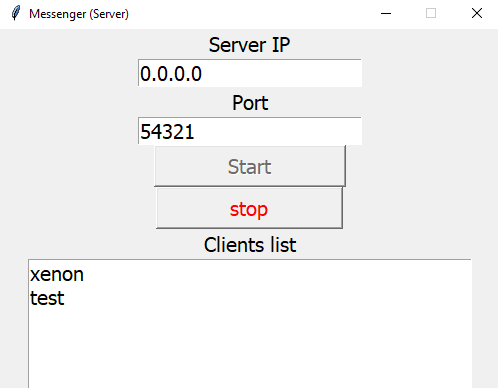
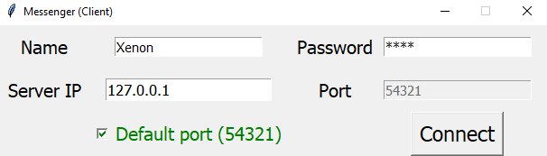
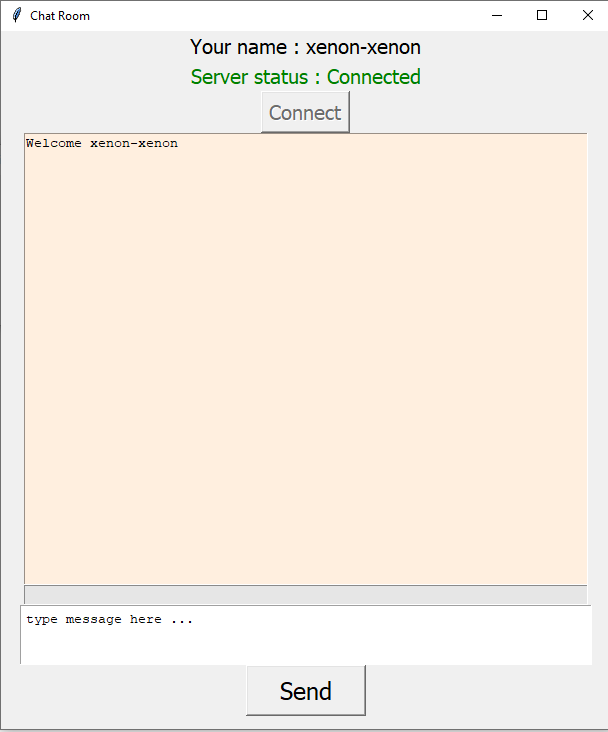
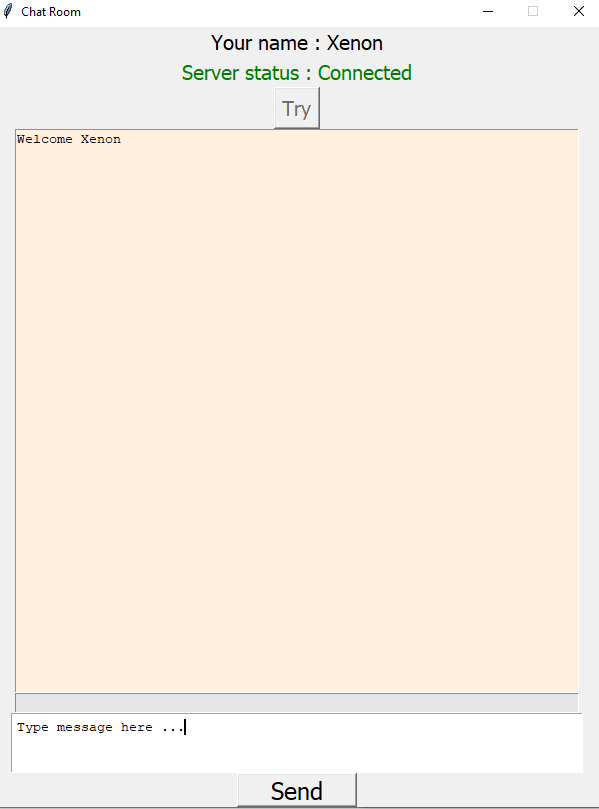

# Python multi user GUI messenger
- GUI messenger app for both server and clients
# Features :
- Checking clients messages from server `Shell`
- Checking connected clients
# Note 
- There is no need for `password` in client app just fill the password with a character
- Default port is `54321` but you can change the port
- After opening the `Chat Room` window , press `Try` button to connect
# To Run The App :
# Server Side : 
- 1)Open `ServerGUI.py` and enter IP and port number, press `Start` for listening
-  
- 2)Then start `ClientGUI.py` , connect the clients and you can see them in clients list 
-  

# Client side :
- 1)Enter the information (no need for password just fill it with a character)
- 2)Press `Connect`
- 
- 3)Press `Try` to connect to the server
- 
- 4)Then you can send and receive messages from connected clients 
- 
